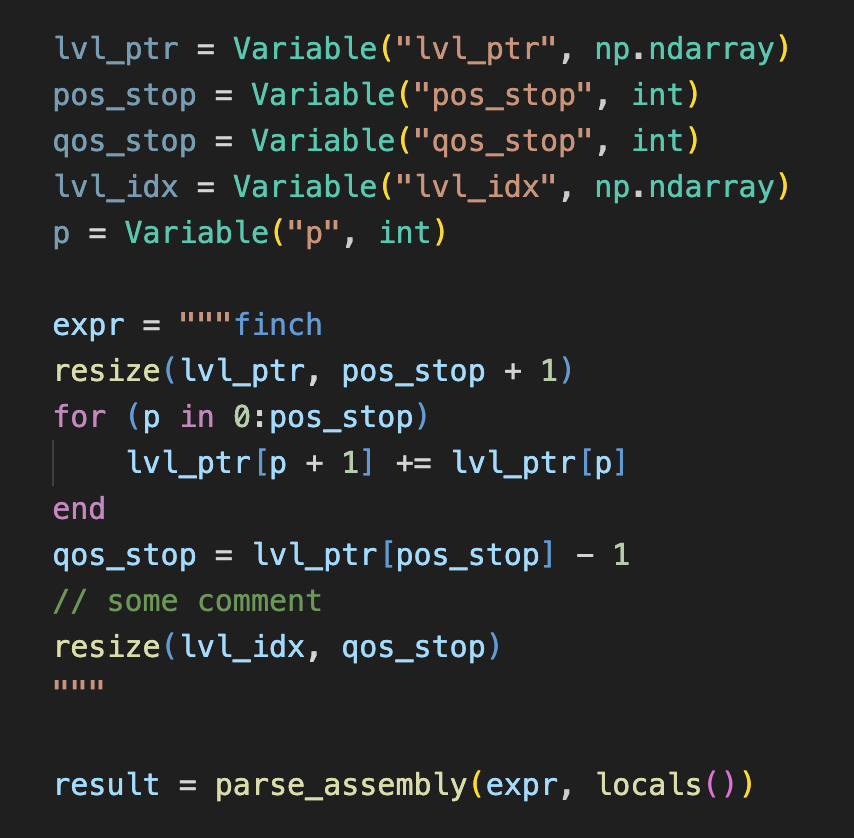

# Finch Assembly in VS Code

Finch Assembly highlighting for Python multiline strings.

## How to use it

Highlighting is supported only for Python multiline strings `"""..."""`.

Start your first line with `finch` or `finch-asm` tag to make given string
highlighted. The tag must go right after opening `"""` quotation marks and
end with a newline.

